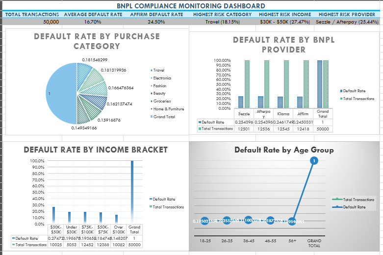

# BNPL Compliance Monitoring Dashboard

## 📊 Project Overview
This project analyzes **50,000+ BNPL (Buy Now Pay Later) transactions** to identify default risk patterns and provide actionable compliance insights. The dashboard tracks default rates by purchase category, BNPL provider, income bracket, and age group — with a high-risk transaction watchlist for priority review.

## 🎯 Objective
To demonstrate how data-driven compliance monitoring can help identify high-risk segments, flag unusual activity, and support escalation workflows — directly applicable to fintech risk and payments operations roles.

## 🔍 Key Analyses
- Default rates by purchase category (Travel, Electronics, Fashion, Beauty, Groceries, Home & Furniture)
- Default rates by BNPL provider (Affirm, Klarna, Sezzle, Afterpay)
- Default rates by income bracket (Under $30K, $30K-$50K, $50K-$75K, $75K-$100K, Over $100K)
- Default rates by age group (18-25, 26-35, 36-45, 46-55, 56+)
- High-risk transaction watchlist for priority review

## 📈 Key Findings
- **Travel and Electronics** have the highest default rates (18.15%, 18.13%) — significantly above the 16.7% average
- The **$30K-$50K income bracket** shows outlier risk at **27.47%** — nearly 8 points above average
- **Affirm has the lowest default rate among BNPL providers** at 24.50%, outperforming Sezzle, Afterpay, and Klarna
- Customers aged **36-45** represent the largest transaction volume with above-average default rates — a priority segment for monitoring

## 🚨 High-Risk Watchlist
The dashboard includes a watchlist of transactions flagged for:
- Defaulted or late payment status
- High-risk categories (Travel, Electronics)
- High-risk income bracket ($30K-$50K)
- High transaction amounts

These flags support compliance teams in prioritizing reviews and escalations.

## 🛠️ Tools Used
- **SQL:** Data preparation and analysis
- **Excel:** PivotTables, charts, conditional formatting, dashboard design
- **Data Source:** 50,000+ simulated BNPL transactions

## 📁 Files
- `bnpl_analysis.xlsx` - Full Excel dashboard with pivot tables and charts
- `insights_summary.md` - Written insights and recommendations
- `dashboard_screenshot.png` - Screenshot of the final dashboard

## 🧠 Why This Matters
This project demonstrates the ability to:
- Analyze large datasets to identify risk patterns
- Build data-driven compliance monitoring tools
- Translate complex data into actionable insights
- Support escalation and review workflows — exactly what fintech risk and payments teams need.

## 📬 Contact
**Jenna Pozzebon** 
www.linkedin.com/in/jenna-pozzebon
jennapozzebon@gmail.com

